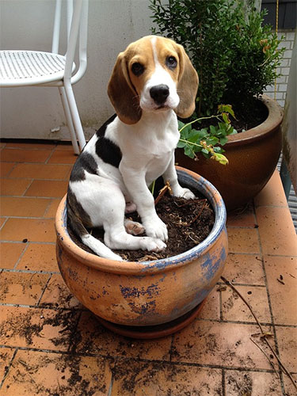

# A Simple Keras + deep learning REST API

This repository contains the code for [*Building a simple Keras + deep learning REST API*](https://blog.keras.io/building-a-simple-keras-deep-learning-rest-api.html), published on the Keras.io blog.

The method covered here is intended to be instructional. It is _not_ meant to be production-level and capable of scaling under heavy load. If you're interested in a more advanced Keras REST API that leverages message queues and batching, [please refer to this tutorial](https://www.pyimagesearch.com/2018/01/29/scalable-keras-deep-learning-rest-api/).

For an _even more advanced version_ that includes deploying a model to production, [refer to this blog post](https://www.pyimagesearch.com/2018/02/05/deep-learning-production-keras-redis-flask-apache/).

## Getting started

I assume you already have Keras (and a supported backend) installed on your system. From there you need to install [Flask](http://flask.pocoo.org/) and [requests](http://docs.python-requests.org/en/master/):

```sh
$ pip install flask gevent requests
```

Next, clone the repo:

```sh
$ git clone https://github.com/jrosebr1/simple-keras-rest-api.git
```

## Starting the Keras server

Below you can see the image we wish to classify, a _dog_, but more specifically a _beagle_:



The Flask + Keras server can be started by running:

```sh
$ python run_keras_server.py 
Using TensorFlow backend.
 * Loading Keras model and Flask starting server...please wait until server has fully started
...
 * Running on http://127.0.0.1:5000
```

You can now access the REST API via `http://127.0.0.1:5000`.

## Submitting requests to the Keras server

Requests can be submitted via cURL:

```sh
$ curl -X POST -F image=@dog.jpg 'http://localhost:5000/predict'
{
  "predictions": [
    {
      "label": "beagle", 
      "probability": 0.9901360869407654
    }, 
    {
      "label": "Walker_hound", 
      "probability": 0.002396771451458335
    }, 
    {
      "label": "pot", 
      "probability": 0.0013951235450804234
    }, 
    {
      "label": "Brittany_spaniel", 
      "probability": 0.001283277408219874
    }, 
    {
      "label": "bluetick", 
      "probability": 0.0010894243605434895
    }
  ], 
  "success": true
}
```

Or programmatically:

```sh
$ python simple_request.py 
1. beagle: 0.9901
2. Walker_hound: 0.0024
3. pot: 0.0014
4. Brittany_spaniel: 0.0013
5. bluetick: 0.0011
```